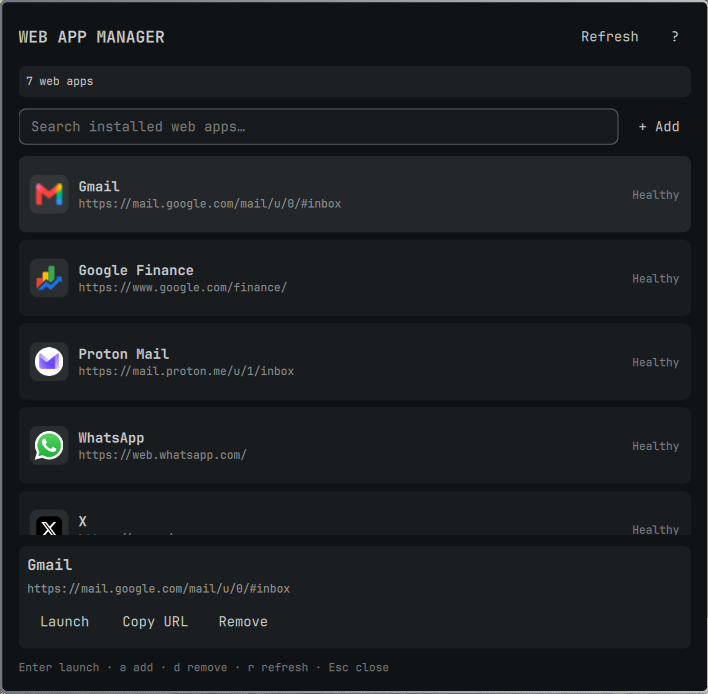

# Web App Manager

An Omarchy bar plugin for discovering, launching, installing, and removing user-owned web-app launchers.

## Preview



## Status

This is the first implementation pass. It supports the core workflow:

- Scan Omarchy web-app desktop entries in the user application directory.
- Search and launch an installed web app.
- Install a new web app through `omarchy webapp install`.
- Move a selected launcher to the user trash for reversible removal.
- Report invalid URLs, missing icons, and protocol handlers.

The plugin accepts only exact `omarchy-launch-webapp <http(s)-url>` and `omarchy-webapp-handler-<name> %u` command templates. It never executes an arbitrary desktop-file `Exec=` command and does not expose MIME-type editing.

## Security boundaries

Desktop-entry scanning uses Omarchy's Perl dependency with core modules to open each candidate once using O_NOFOLLOW|O_NONBLOCK, verify a user-owned regular-file descriptor, and enforce bounded file, field, and JSON-output sizes. Launching consumes the same strict parser result and invokes only trusted Omarchy executables, avoiding a second desktop-file open. Oversized, replaced, non-regular, or nonconforming entries are skipped safely.

## Install for local development

Clone or copy this repository into the Omarchy user plugin directory:

```bash
mkdir -p ~/.config/omarchy/plugins
ln -sfn "$PWD" ~/.config/omarchy/plugins/io.github.ef-code.webapp-manager
```

Add the widget to the bar using the normal Omarchy plugin workflow, then reload the shell if needed:

```bash
omarchy-shell shell rescanPlugins
```

## Native commands used

The plugin uses Omarchy's existing command surface for installation:

```text
omarchy webapp install [name url icon-url-or-name]
omarchy-launch-webapp <url>
```

The helper scans only `${XDG_DATA_HOME:-$HOME/.local/share}/applications`, refuses to mutate system desktop entries, and uses the freedesktop trash service for reversible removal.

## Validation

```bash
omarchy plugin validate .
qmllint -I "${OMARCHY_PATH:-/usr/share/omarchy}/shell" \
  BarWidget.qml Panel.qml WebAppController.qml WebAppModel.js
bash -n scripts/webapp-managerctl
perl -c scripts/webapp-manager-scan.pl
shellcheck -S style scripts/webapp-managerctl tests/test-webapp-managerctl.sh
tests/test-webapp-managerctl.sh
scripts/webapp-managerctl scan | jq .
```

## Roadmap

- Browser/profile selection using an allowlisted command template.
- Icon preview and refresh.
- Desktop-entry repair and backup history.
- MIME association management with an explicit warning.
- Import/export of web-app definitions.
